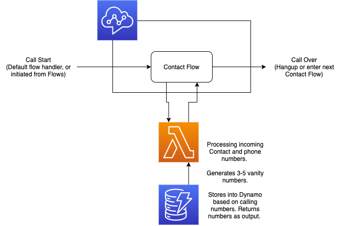
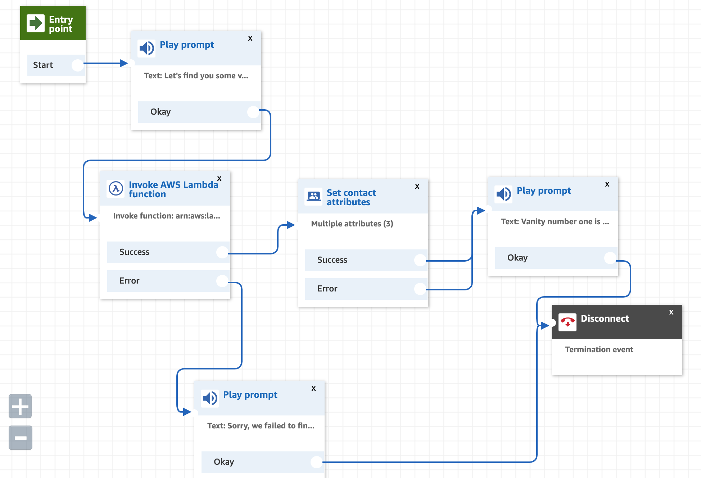

# connect-lesson

This project was a lesson in AWS Connect, both the setup and configuration of the service ("Part 1"), and the deployment of the service ("Part 2"). Links and refernces will be included here, until I shut down the services within AWS to avoid billing.

# Part 1: The Connect Service

## User Story

Call a number connected to an AWS Connect call center, and hear the top three vanity numbers based on the caller's phone number.

## Technical setup

### AWS

I created an AWS account to run these services. The captchas were the worst I've ever seen!

> While performing all these tasks as the root user on the account, a proper IAM user (with MFA login) would have been better.

### AWS Connect

The basic setup of this project was acheived in the web consoles, setting up AWS Connect and a new Lambda function. See this diagram for a visual:

I started with the Lambda function so that could be imported into Connect. DynamoDB would be added next, no problem to write that in Javascript. Final function is in this repository, (lambda.js)[lambda.js]

> Connect lambda did not like an async() function, it required the callback style for me. Is that normal?

The default number on the Connect instance was configured to start with a new custom flow.

> The default flow for a number would likely be a "directory flow" to direct the Contact to the appropiate flow.

> Default flows are abundant in Connect. I saw no way to delete them. Perhaps modify them all so the flow listing is not so junky? How is this manageable with 10's or 100's of flows?

This flow was connected to the Lambda function, utilizing text-to-speech to inform the caller of their new vanity numbers. These vanity numbers were also stored in in the Contact as well.

And then, success!

Give it a try, call **+1 866-209-0186** and you'll hear this in action. The first vanity number will be your calling area-code and then 867-5309. (_unless you're outside the US, then the digits might work out funny_).

> Future improvments could be looking up the Contact's number to know more about them before trying to generate vanity numbers. Or the awesome new VoiceID features. Having the user choose a number or ask for more choices would be an interesting upgrade.

# Part 2: Deployment

## User Story

As a client who wanted to install a great vanity number generator (or a technical reviewer reading this docuemnt), run an automated process to build a Cloud stack that includes Connect, Lambda, DynamoDB with as little input as possible. A one-button deploy is the goal, perhaps with necessary AWS credentials or region IDs.

## Technical Setup

This part has two pieces:

1. a Custom Resource in Cloud Formation that connects a Lambda function to a Connect Flow.
2. A "deploy script" (CloudFormation, Terraform, CDK) that builds the entire stack.

This is where my project is going to pause and I will have to practice more AWS Cloud Formation and the configuration syntax. Or learn of better tools for generation (I did not find (CloudFormation Designer)[https://console.aws.amazon.com/cloudformation/designer/home?region=us-east-1] very helpful.)

The best example I found, that was similar to my final goal, came from AWS themselves, in their (chat-ui CloudFormation example)[https://github.com/amazon-connect/amazon-connect-chat-ui-examples/blob/master/cloudformationTemplates/startChatContactAPI/cloudformation.yaml].

In that file:

- Inputs are defined (lines 14-31)
- Lambda is setup (lines 49 - 122)
- and instead of the chat API gateway, I would install the CustomResource that creates a contact flow and connects the lambda

Also their (other example)[https://github.com/amazon-connect/ai-powered-speech-analytics-for-amazon-connect/blob/main/deployment/ai-powered-speech-analytics-for-amazon-connect.yaml] which showed creation of a DynamoDB.

All that is easier said than done! I learn a lot from hands-on experiece, and some trial and error. That is where my education will take me next : )
